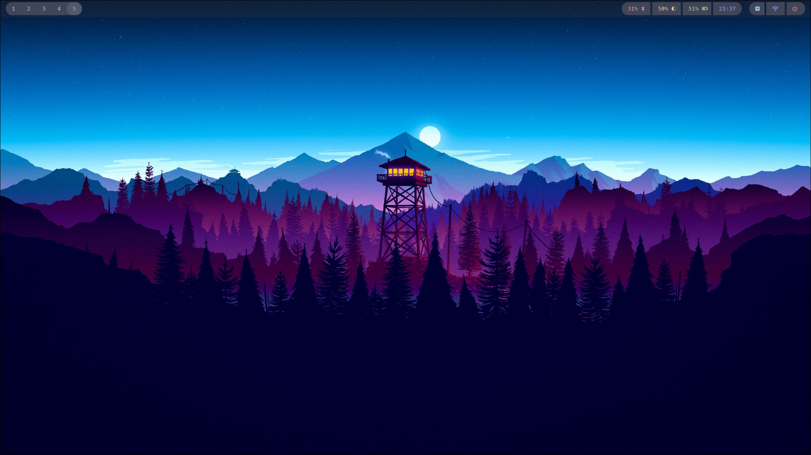
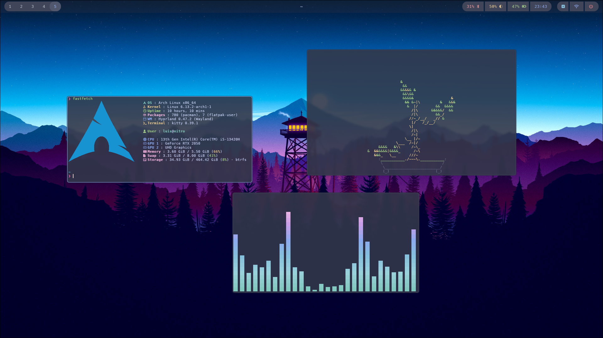
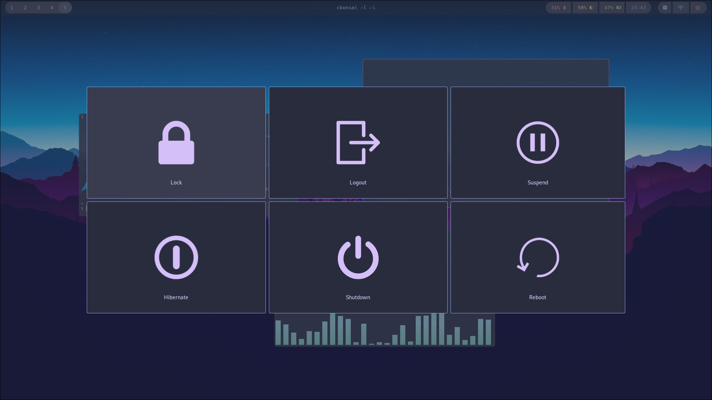

# My Dotfiles

This repository contains the dotfiles for my Arch Linux setup, featuring custom configurations for various software and tools I use.

## Included Configurations

- [Hyprland](https://hyprland.org)
- [Hyprpaper](https://wiki.hyprland.org/Hypr-Ecosystem/hyprpaper)
- [Hyprlock](https://wiki.hyprland.org/Hypr-Ecosystem/hyprlock)
- [Hypridle](https://wiki.hyprland.org/Hypr-Ecosystem/hypridle)
- [Kitty](https://github.com/kovidgoyal/kitty)
- [Wofi](https://hg.sr.ht/~scoopta/wofi)
- [Wlogout](https://github.com/ArtsyMacaw/wlogout)
- [Waybar](https://github.com/Alexays/Waybar)
- [Neovim](https://github.com/neovim/neovim)
- [Fastfetch](https://github.com/fastfetch-cli/fastfetch)
- [Bat](https://github.com/sharkdp/bat)
- [Cava](https://github.com/karlstav/cava)
- [SwayNC](https://github.com/ErikReider/SwayNotificationCenter)
- [Zinit](https://github.com/zdharma-continuum/zinit)

## Screenshots

Here are some screenshots showcasing the configurations:

- **Only the desktop**  
  
  
- **With some apps open**  
  
  
- **Wlogout Screen**  
  
